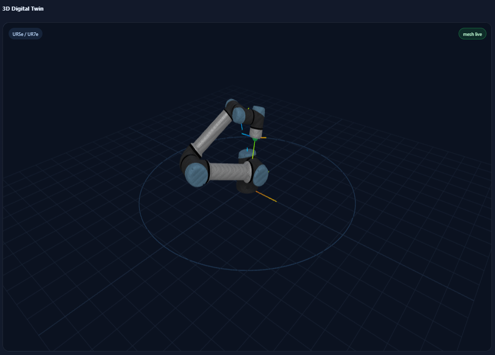
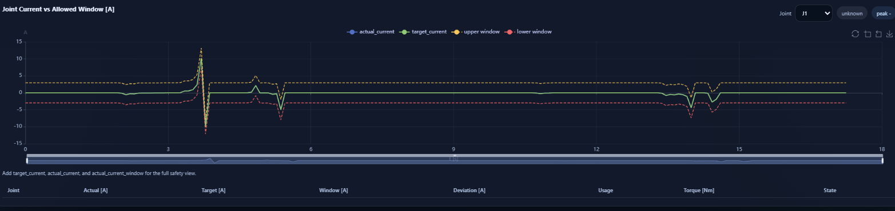

# RTDE Reference Program (EN/KR)

A Windows-friendly **reference program** for Universal Robots RTDE.

> [!IMPORTANT]
> This repository is a **reference program** for inspection, integration, learning, and validation.
> It is **not** a certified safety product and must not be used as the only protective measure.

> [!IMPORTANT]
> 이 저장소는 점검, 연동, 학습, 검증을 위한 **참고 프로그램**입니다.
> 인증된 안전 제품이 아니며, 단독 보호 수단으로 사용하면 안 됩니다.

---

## 📚 Documentation

👉 https://shh444.github.io/ur-rtde/

---

## Screenshots

<p align="center">
  
  
</p>

---

## EN

### What this repository is for

This repository helps you do three things with less friction:

1. inspect robot state in a browser,
2. read and write RTDE data from Python,
3. publish internal guidance with Sphinx + GitHub Pages.

The project intentionally keeps the RTDE field names close to the real Universal Robots names so that the web interface, the Python API, and the official RTDE field tables line up naturally.

### Main features

- split `backend/` and `frontend/` structure
- one-place robot IP configuration in `app_config.py`
- real RTDE field names such as `timestamp`, `actual_q`, `actual_TCP_pose`, and `input_int_register_24`
- mesh-based digital twin with procedural fallback
- live values, live charts, CSV recording, JSON export, and event logging
- current-window monitoring using `target_current`, `actual_current`, and `actual_current_window`
- simple wrapper class: `UR_RTDE`
- core class API: `URRobot`
- Separate Sphinx trees for **EN-only** and **KO-only** navigation
- GitHub Pages workflow under `.github/workflows/docs.yml`

### Quick start on Windows

```powershell
py -3 -m venv .venv
./.venv/Scripts/Activate.ps1
python -m pip install --upgrade pip
pip install -r ./backend/requirements.txt
python ./run_dashboard.py
```

Open the browser:

```text
http://127.0.0.1:8008
```

### Single-source runtime configuration

Edit only `app_config.py`:

```python
ROBOT_HOST = "192.168.163.128"
ROBOT_FREQUENCY_HZ = 125.0
ROBOT_MODEL = "ur5e"
ROBOT_FIELDS = [
    "timestamp",
    "actual_q",
    "actual_TCP_pose",
]
```

### Recommended field sets

High-rate digital twin:

```python
ROBOT_FREQUENCY_HZ = 500.0
ROBOT_FIELDS = [
    "timestamp",
    "actual_q",
    "actual_TCP_pose",
]
```

Current-window monitoring:

```python
ROBOT_FREQUENCY_HZ = 125.0
ROBOT_FIELDS = [
    "timestamp",
    "actual_q",
    "actual_TCP_pose",
    "target_current",
    "actual_current",
    "actual_current_window",
]
```

### Python API example

```python
from ur_rtde_api import UR_RTDE

robot = UR_RTDE(
    HOST="192.168.163.128",
    FREQUENCY_HZ=125,
    FIELD=[
        "timestamp",
        "actual_q",
        "actual_TCP_pose",
        "input_int_register_24",
    ],
)

robot.start()
try:
    print(robot["actual_q"])
    robot["input_int_register_24"] = 33
    print(robot["input_int_register_24"])
finally:
    robot.stop()
    robot.close()
```

### Sphinx docs and GitHub Pages

Install doc dependencies:

```powershell
pip install -r ./docs/requirements.txt
```

Build docs locally:

```powershell
python -m sphinx -M html docs/source docs/build
```

Open:

```text
docs/build/html/index.html
```

The repository already includes `.github/workflows/docs.yml` for GitHub Pages deployment.

---

## KR

### 이 저장소의 목적

이 저장소는 다음 세 가지를 더 쉽게 하기 위한 참고 프로그램입니다.

1. 브라우저에서 로봇 상태를 확인하기
2. Python에서 RTDE 데이터를 읽고 쓰기
3. Sphinx + GitHub Pages로 내부 문서를 배포하기

웹 인터페이스, Python API, 공식 RTDE 표가 자연스럽게 연결되도록 실제 Universal Robots RTDE 필드명을 최대한 그대로 유지합니다.

### 주요 기능

- `backend/` 와 `frontend/` 분리 구조
- `app_config.py` 한 곳에서 로봇 IP 설정
- `timestamp`, `actual_q`, `actual_TCP_pose`, `input_int_register_24` 같은 실제 RTDE 필드명 사용
- mesh 기반 디지털 트윈과 procedural fallback
- 실시간 값, 차트, CSV 기록, JSON export, 이벤트 로그
- `target_current`, `actual_current`, `actual_current_window` 기반 current-window 모니터링
- 간단한 래퍼 클래스 `UR_RTDE`
- 코어 클래스 API `URRobot`
- 영문 전용 / 한글 전용으로 분리된 Sphinx 문서
- `.github/workflows/docs.yml` 기반 GitHub Pages 배포

### Windows 빠른 시작

```powershell
py -3 -m venv .venv
./.venv/Scripts/Activate.ps1
python -m pip install --upgrade pip
pip install -r ./backend/requirements.txt
python ./run_dashboard.py
```

브라우저 주소:

```text
http://127.0.0.1:8008
```

### 단일 설정 파일

`app_config.py` 만 수정하면 됩니다.

```python
ROBOT_HOST = "192.168.163.128"
ROBOT_FREQUENCY_HZ = 125.0
ROBOT_MODEL = "ur5e"
ROBOT_FIELDS = [
    "timestamp",
    "actual_q",
    "actual_TCP_pose",
]
```

### 권장 필드 조합

고속 디지털 트윈:

```python
ROBOT_FREQUENCY_HZ = 500.0
ROBOT_FIELDS = [
    "timestamp",
    "actual_q",
    "actual_TCP_pose",
]
```

Current-window 모니터링:

```python
ROBOT_FREQUENCY_HZ = 125.0
ROBOT_FIELDS = [
    "timestamp",
    "actual_q",
    "actual_TCP_pose",
    "target_current",
    "actual_current",
    "actual_current_window",
]
```

### Python API 예제

```python
from ur_rtde_api import UR_RTDE

robot = UR_RTDE(
    HOST="192.168.163.128",
    FREQUENCY_HZ=125,
    FIELD=[
        "timestamp",
        "actual_q",
        "actual_TCP_pose",
        "input_int_register_24",
    ],
)

robot.start()
try:
    print(robot["actual_q"])
    robot["input_int_register_24"] = 33
    print(robot["input_int_register_24"])
finally:
    robot.stop()
    robot.close()
```

### Sphinx 문서와 GitHub Pages

문서 의존성 설치:

```powershell
pip install -r ./docs/requirements.txt
```

로컬 빌드:

```powershell
python -m sphinx -M html docs/source docs/build
```

결과 파일:

```text
docs/build/html/index.html
```

GitHub Pages 배포용 workflow는 `.github/workflows/docs.yml` 에 이미 포함되어 있습니다.
